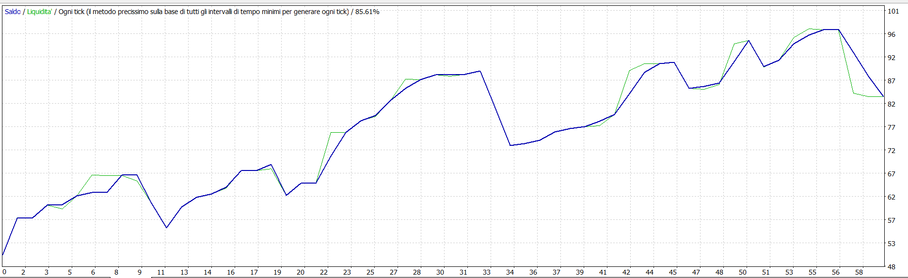

<div align="center">

# 🤖 Cala_bot — XAUUSD Scalper EA

**EA professionale per MetaTrader 4/5 — Scalping su XAUUSD (Oro)**

[
[
[
[

***

*🇮🇹 Versione Italiana | 🇬🇧 English Version below*

</div>

***

## 🇮🇹 ITALIANO

### 📌 Descrizione

**Cala_bot** è un Expert Advisor (EA) per MetaTrader 4 progettato per fare scalping sull'oro (XAUUSD) sul timeframe M5. Il bot combina un sistema multi-indicatore avanzato con una gestione del rischio robusta per identificare e sfruttare opportunità di trading ad alta probabilità durante le sessioni di mercato europee e americane.

> ⚠️ **Disclaimer:** Il trading comporta rischi significativi. I risultati del backtest non garantiscono performance future. Usa sempre un account demo prima di operare con denaro reale.

***

### 📊 Risultati Backtest

| Metrica | Valore |
|---|---|
| Deposito iniziale | $50.00 |
| Profitto netto | **+$33.28 (+66%)** |
| Profit Factor | **1.57** |
| Win Rate totale | **83.05%** |
| Win Rate BUY | 88.89% |
| Win Rate SELL | 78.12% |
| Operazioni totali | 59 |
| Drawdown massimo | 22.57% |
| Max perdite consecutive | 3 |
| Qualità modello | 85.61% |

> 📸 

***

### ⚙️ Come Funziona

#### 1. Sistema di Segnale Multi-Indicatore

Il bot analizza ogni candela M5 e genera un segnale BUY o SELL solo quando **tutti** i seguenti filtri sono soddisfatti simultaneamente:

**Indicatori principali:**
- **EMA Fast (8) + EMA Slow (21)** — incrocio per il segnale direzionale
- **EMA Trend (200)** — filtro di tendenza principale
- **Higher Timeframe Trend (M15)** — conferma della direzione sul timeframe superiore
- **RSI (14)** — filtro per evitare zone di ipercomprato/ipervenduto
  - BUY: RSI tra 40 e 65
  - SELL: RSI tra 35 e 60
- **ADX (14)** — minimo 25 per confermare che il mercato è in trend
- **ATR (14)** — filtra volatilità troppo bassa o spike eccessivi

#### 2. Filtri di Qualità della Candela

Prima di aprire un trade, il bot verifica:
- Corpo della candela minimo (10 punti)
- Range della candela proporzionale all'ATR (≥ 0.5x ATR)
- Assenza di spike di volatilità anomali (> 2.5x ATR)

#### 3. Gestione dell'Ordine

- **Stop Loss e Take Profit basati su ATR** — si adattano dinamicamente alla volatilità del momento
  - SL = ATR × 1.5
  - TP = ATR × 1.2
- **Lot size fisso** a 0.01 per gestione del rischio conservativa
- Massimo **3 trade aperti contemporaneamente**
- Un solo trade per candela (OneTradePerBar)

#### 4. Gestione Avanzata della Posizione

Una volta aperto il trade, il bot gestisce automaticamente:

**Break Even:**
- Quando il prezzo si muove di 100 punti in favore, lo SL viene spostato **esattamente al prezzo di entrata** → rischio zero sul trade

**Trailing Stop:**
- Attivato solo quando il trade è in profitto di almeno 80 punti
- Segue il prezzo a distanza di 80 punti
- Protezione da inversioni improvvise mantenendo i profitti aperti

#### 5. Filtri di Sessione

Il bot opera **solo** nelle ore più liquide:
- **Sessione attiva:** 09:00 → 20:00 (ora del broker)
- **Cutoff venerdì:** 15:00 per evitare gap del weekend
- Nessun trade fuori sessione o in periodi di bassa liquidità

#### 6. Risk Management Completo

| Protezione | Valore |
|---|---|
| Perdita giornaliera max (%) | 20% |
| Perdita giornaliera max ($) | $50 |
| Trade giornalieri massimi | 20 |
| Perdite consecutive max | 5 |
| Drawdown massimo | 20% |
| Chiusura forzata al limite | ✅ Sì |
| Blocco dopo streak negativa | ✅ Sì |

***

### 🛠️ Installazione

1. Copia i file `.mqh` nella cartella `MQL4/Include/XAUUSD_Scalper/` del tuo MetaTrader
2. Copia il file `.mq4` principale nella cartella `MQL4/Experts/`
3. Ricompila dall'editor MetaEditor (F7)
4. Trascina l'EA sul grafico XAUUSD M5
5. Carica il file `.set` con i parametri ottimizzati
6. Abilita il **trading automatico** e il **DLL import**

***

### ⚙️ Parametri Principali

| Parametro | Valore Default | Descrizione |
|---|---|---|
| `MagicNumber` | 100100 | ID univoco del bot |
| `FixedLotSize` | 0.01 | Dimensione lotto fissa |
| `MaxOpenTrades` | 3 | Trade contemporanei massimi |
| `TrailingStopPoints` | 80 | Distanza trailing stop (punti) |
| `BreakEvenAtPoints` | 100 | Trigger break even (punti) |
| `SessionStartHour` | 9 | Ora inizio sessione |
| `SessionEndHour` | 20 | Ora fine sessione |
| `MaxDailyLossPercent` | 20% | Protezione perdita giornaliera |

***

### 📁 Struttura File

```
XAUUSD_Scalper/
├── Cala_bot.mq4              ← EA principale
├── Cala_bot.set              ← Preset parametri ottimizzati
└── Include/
    └── XAUUSD_Scalper/
        ├── Config.mqh         ← Parametri e configurazione
        ├── Defines.mqh        ← Costanti e definizioni globali
        ├── Indicators.mqh     ← Calcolo e caching degli indicatori
        ├── Logger.mqh         ← Sistema di logging su file/console
        ├── PositionManager.mqh← Gestione trailing stop e break even
        ├── RiskManager.mqh    ← Gestione rischio, drawdown, protezioni
        ├── SignalEngine.mqh   ← Motore dei segnali (logica entry)
        └── TradeExecutor.mqh  ← Esecuzione ordini e gestione slippage
```

**Descrizione dei moduli:**

| File | Ruolo |
|---|---|
| `Config.mqh` | Tutti i parametri input dell'EA in un unico posto |
| `Defines.mqh` | Costanti, enumerazioni e macro globali |
| `Indicators.mqh` | Calcola e cachea EMA, RSI, ADX, ATR per efficienza |
| `Logger.mqh` | Logging dettagliato su console e file per debug |
| `PositionManager.mqh` | Gestisce break even e trailing stop su ogni tick |
| `RiskManager.mqh` | Controlla perdite giornaliere, drawdown, streak di perdite |
| `SignalEngine.mqh` | Valuta tutti i filtri e genera il segnale BUY/SELL |
| `TradeExecutor.mqh` | Apre, modifica e chiude ordini con gestione slippage |

***

### ⚠️ Requisiti

- MetaTrader 4
- Simbolo: **XAUUSD**
- Timeframe: **M5**
- Spread consigliato: ≤ 30 punti
- VPS consigliato per operatività continua

***

***

## 🇬🇧 ENGLISH

### 📌 Description

**Cala_bot** is an Expert Advisor (EA) for MetaTrader 4 designed for scalping Gold (XAUUSD) on the M5 timeframe. The bot combines an advanced multi-indicator system with robust risk management to identify and exploit high-probability trading opportunities during European and American market sessions.

> ⚠️ **Disclaimer:** Trading involves significant risk. Backtest results do not guarantee future performance. Always use a demo account before trading with real money.

***

### 📊 Backtest Results

| Metric | Value |
|---|---|
| Initial deposit | $50.00 |
| Net profit | **+$33.28 (+66%)** |
| Profit Factor | **1.57** |
| Overall Win Rate | **83.05%** |
| BUY Win Rate | 88.89% |
| SELL Win Rate | 78.12% |
| Total trades | 59 |
| Maximum Drawdown | 22.57% |
| Max consecutive losses | 3 |
| Model quality | 85.61% |

> 📸 

***

### ⚙️ How It Works

#### 1. Multi-Indicator Signal System

The bot analyzes every M5 candle and generates a BUY or SELL signal only when **all** of the following filters are satisfied simultaneously:

**Core indicators:**
- **EMA Fast (8) + EMA Slow (21)** — crossover for directional signal
- **EMA Trend (200)** — primary trend filter
- **Higher Timeframe Trend (M15)** — direction confirmation on higher timeframe
- **RSI (14)** — filter to avoid overbought/oversold zones
  - BUY: RSI between 40 and 65
  - SELL: RSI between 35 and 60
- **ADX (14)** — minimum 25 to confirm market is trending
- **ATR (14)** — filters out low volatility or excessive spikes

#### 2. Candle Quality Filters

Before opening a trade, the bot checks:
- Minimum candle body size (10 points)
- Candle range proportional to ATR (≥ 0.5x ATR)
- No abnormal volatility spikes (> 2.5x ATR)

#### 3. Order Management

- **ATR-based Stop Loss and Take Profit** — dynamically adapts to current volatility
  - SL = ATR × 1.5
  - TP = ATR × 1.2
- **Fixed lot size** of 0.01 for conservative risk management
- Maximum **3 simultaneous open trades**
- One trade per candle (OneTradePerBar)

#### 4. Advanced Position Management

Once a trade is open, the bot automatically manages:

**Break Even:**
- When the price moves 100 points in favor, the SL is moved **exactly to the entry price** → zero risk on the trade

**Trailing Stop:**
- Only activated when the trade is in profit by at least 80 points
- Follows price at a distance of 80 points
- Protection from sudden reversals while keeping profits running

#### 5. Session Filters

The bot operates **only** during the most liquid hours:
- **Active session:** 09:00 → 20:00 (broker time)
- **Friday cutoff:** 15:00 to avoid weekend gaps
- No trades outside session or during low liquidity periods

#### 6. Complete Risk Management

| Protection | Value |
|---|---|
| Max daily loss (%) | 20% |
| Max daily loss ($) | $50 |
| Max daily trades | 20 |
| Max consecutive losses | 5 |
| Max drawdown | 20% |
| Force close at daily limit | ✅ Yes |
| Block after loss streak | ✅ Yes |

***

### 🛠️ Installation

1. Copy `.mqh` files to `MQL4/Include/XAUUSD_Scalper/` folder in your MetaTrader
2. Copy the main `.mq4` file to `MQL4/Experts/` folder
3. Recompile from MetaEditor (F7)
4. Drag the EA onto the XAUUSD M5 chart
5. Load the `.set` file with optimized parameters
6. Enable **automated trading** and **DLL imports**

***

### ⚙️ Main Parameters

| Parameter | Default | Description |
|---|---|---|
| `MagicNumber` | 100100 | Bot unique identifier |
| `FixedLotSize` | 0.01 | Fixed lot size |
| `MaxOpenTrades` | 3 | Maximum simultaneous trades |
| `TrailingStopPoints` | 80 | Trailing stop distance (points) |
| `BreakEvenAtPoints` | 100 | Break even trigger (points) |
| `SessionStartHour` | 9 | Session start hour |
| `SessionEndHour` | 20 | Session end hour |
| `MaxDailyLossPercent` | 20% | Daily loss protection |

***

### 📁 File Structure

```
XAUUSD_Scalper/
├── Cala_bot.mq4              ← Main EA file
├── Cala_bot.set              ← Optimized parameter preset
└── Include/
    └── XAUUSD_Scalper/
        ├── Config.mqh         ← Parameters and configuration
        ├── Defines.mqh        ← Global constants and definitions
        ├── Indicators.mqh     ← Indicator calculation and caching
        ├── Logger.mqh         ← File/console logging system
        ├── PositionManager.mqh← Trailing stop and break even management
        ├── RiskManager.mqh    ← Risk management, drawdown, protections
        ├── SignalEngine.mqh   ← Signal engine (entry logic)
        └── TradeExecutor.mqh  ← Order execution and slippage handling
```

**Module descriptions:**

| File | Role |
|---|---|
| `Config.mqh` | All EA input parameters in one place |
| `Defines.mqh` | Global constants, enumerations and macros |
| `Indicators.mqh` | Calculates and caches EMA, RSI, ADX, ATR for efficiency |
| `Logger.mqh` | Detailed logging to console and file for debugging |
| `PositionManager.mqh` | Manages break even and trailing stop on every tick |
| `RiskManager.mqh` | Controls daily losses, drawdown, loss streaks |
| `SignalEngine.mqh` | Evaluates all filters and generates BUY/SELL signal |
| `TradeExecutor.mqh` | Opens, modifies and closes orders with slippage handling |

***

### ⚠️ Requirements

- MetaTrader 4
- Symbol: **XAUUSD**
- Timeframe: **M5**
- Recommended spread: ≤ 30 points
- VPS recommended for continuous operation

***

<div align="center">

**© 2026 Cala_bot — All rights reserved**

*Unauthorized distribution or resale is strictly prohibited.*

</div>
